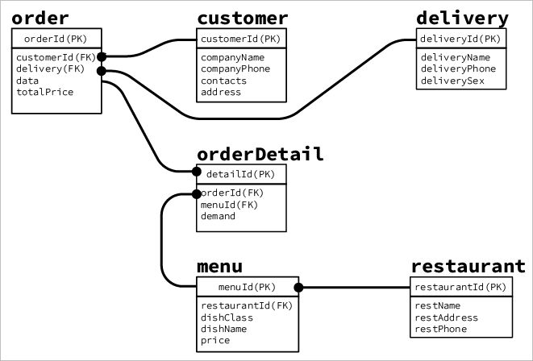

# week2HW
題目 : 訂便當系統，運用上課所學的！！！

# 繳交檔案
homework.txt

# 規劃
- database : dibendon
- table1 : orders - orderId(PK), customerId(FK), date, deliveryId(FK), totalPrice
- table2 : customer - customerId(PK), companyName, companyPhone, contacts, address
- table3 : delivery - deliveryId(PK), deliveryName, deliveryPhone, deliverySex
- table4 : menu - menuId(PK), restaurantId(FK), dishClass, dishName, price
- table5 : restaurant - restaurantId(PK), restName, restAdress, restPhone
- table6 : orderDetail - detailId(PK), orderId(FK), menuId(FK), demand

# 測試
- 8/8 13:50 --> 建立資料表成功,以及除錯
- 8/8 18:30 --> 匯入資料成功,除錯  注意: 餐廳資料表名稱是reataurant
- 8/9 12:06 --> 實作題目一成功